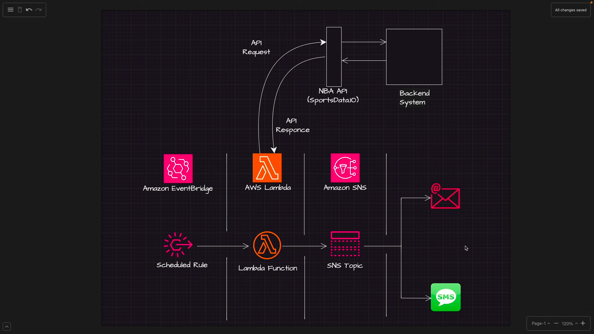
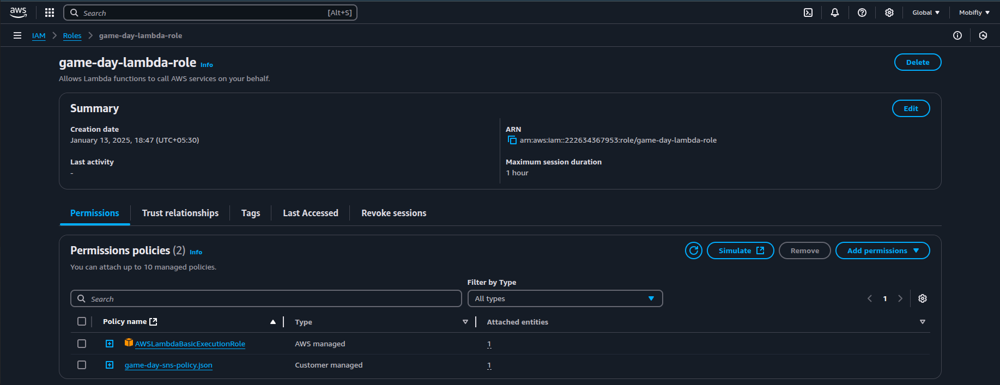
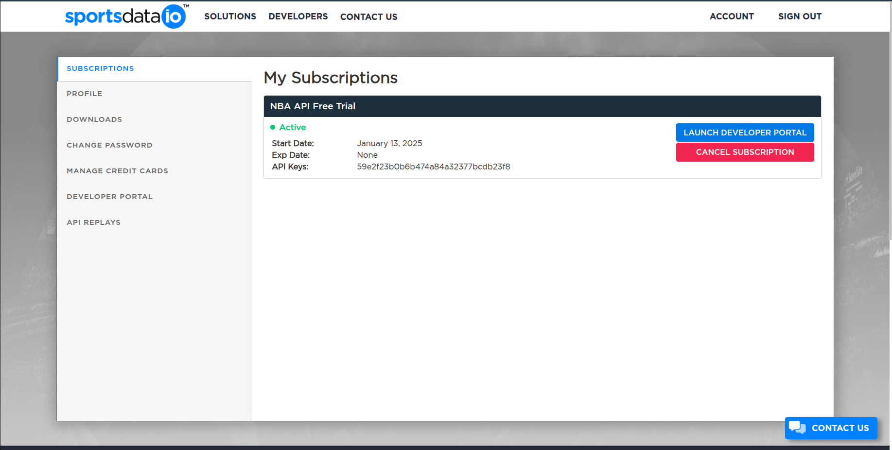
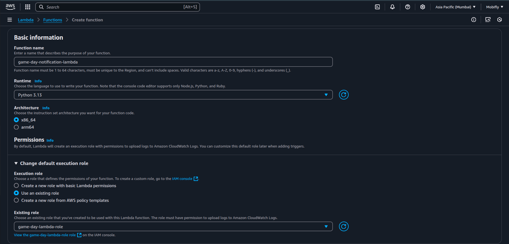
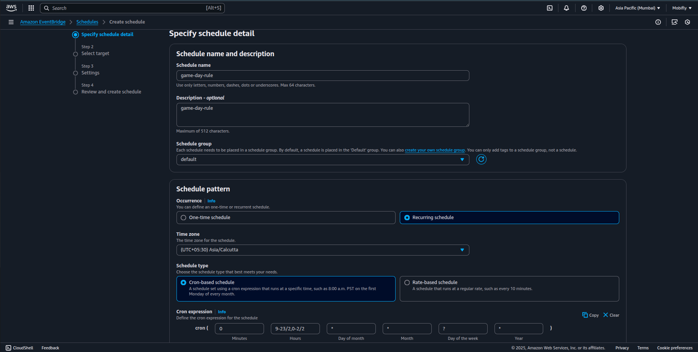

# Game Day Notification Solution - AWS Lambda, SNS, & EventBridge


## Overview
This project demonstrates a notification system for game updates using AWS services like Lambda, SNS, and EventBridge. The solution fetches game data via an API, processes it in AWS Lambda, and sends real-time notifications through SNS. Scheduled tasks are automated with EventBridge.

## Architecture


The architecture consists of:
- **AWS SNS**: Sends notifications to subscribed users.
- **AWS Lambda**: Processes API calls and triggers notifications.
- **AWS EventBridge**: Automates scheduled tasks.
- **SportsData.io API**: Fetches live game data.

## Steps to Implement

### 1. Create SNS Topic and Subscriptions
1. Navigate to the AWS SNS Console.
2. Create a new topic with the name `game-day-sns-topic`.
3. Subscribe to the topic using an email address to receive notifications.

Example Topic ARN:
```
arn:aws:sns:ap-south-1:123456789012:game-day-sns-topic
```


### 2. Configure IAM Policies and Roles
#### Create Policy
The `game-day-policy` grants Lambda permission to publish to the SNS topic.
```json
{
    "Version": "2012-10-17",
    "Statement": [
        {
            "Sid": "AllowLambdaPublish",
            "Effect": "Allow",
            "Action": "sns:Publish",
            "Resource": "arn:aws:sns:ap-south-1:123456789012:game-day-sns-topic"
        }
    ]
}
```

#### Create Role
Create an IAM role named `game-day-role` with the following:
- **AWSLambdaBasicExecutionRole**
- Attach the `game-day-policy` created above.



### 3. Generate API Key
1. Sign up or log in to [SportsData.io](https://sportsdata.io).
2. Create an API key for accessing game data.



### 4. Develop the Lambda Function
1. Write a Python script to fetch game updates and publish notifications.
2. Configure environment variables:
   - **API_KEY**: SportsData.io API key.
   - **SNS_TOPIC_ARN**: SNS topic ARN.




### 5. Schedule with EventBridge
1. Navigate to the EventBridge Console.
2. Create a rule to trigger the Lambda function at regular intervals.
3. Select the Lambda function as the target.



## Outcome
When the Lambda function is triggered, it fetches the latest game updates and sends notifications via SNS to all subscribed users.

## Folder Structure
```
GameDayNotification/
├── README.md
├── images/
│   ├── architecture.png
│   ├── sns_config.png
│   ├── iam_role.png
│   ├── api_key.png
│   ├── lambda_config.png
│   ├── eventbridge_rule.png
├── lambda_function.py
```

## Conclusion
This project highlights the power of AWS services to build scalable and automated notification systems. Feel free to explore and extend this implementation for other use cases.

For any questions or feedback, connect with me on [LinkedIn](https://www.linkedin.com/in/your-profile).
